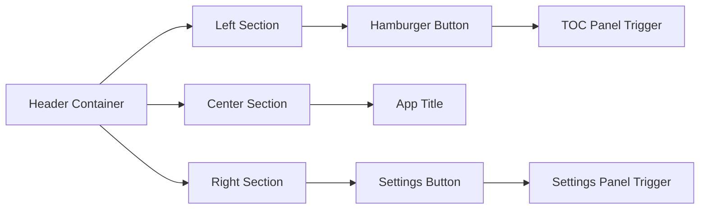
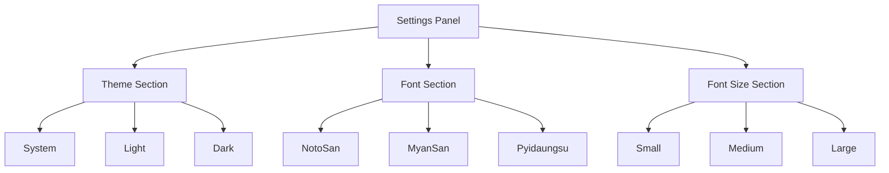
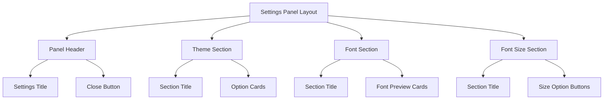
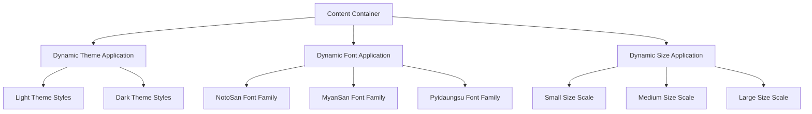
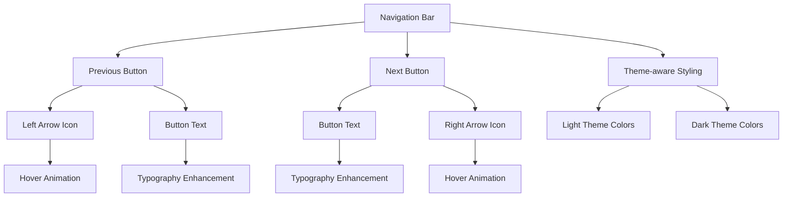
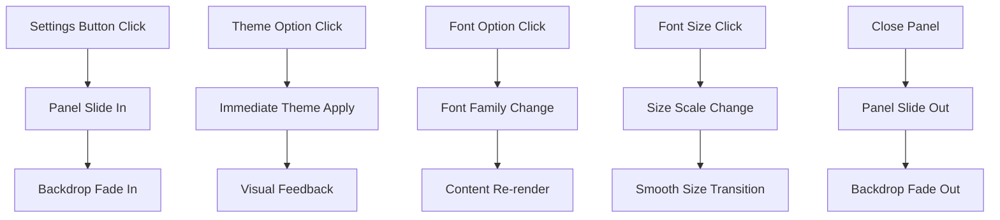
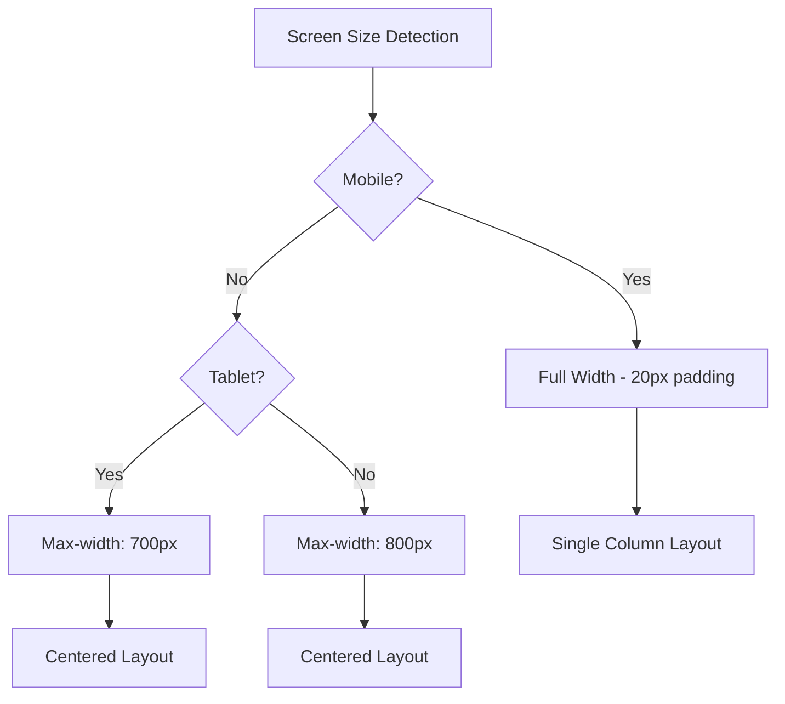

# Novel Reading Application UI Design Improvement

## 1. Overview

The novel reading application is a React-based web application that displays Burmese literary content with navigation and table of contents functionality. The current design uses a light gray and blue color scheme with traditional web styling. This document outlines a comprehensive redesign to achieve a clean, professional aesthetic with comprehensive theme support and user customization options that enhances readability and provides a modern, minimalist user experience.

### Current State
- React 19 with TypeScript frontend application
- Vite-based build system with HMR
- Fixed header with hamburger menu for TOC
- Sidebar table of contents with overlay
- Previous/Next navigation controls
- Responsive design for mobile devices

### Design Goals
- Multi-theme support (System, Light, Dark)
- User customization options for theme, font, and font size
- Configuration-based font management system
- Enhanced typography and readability for Burmese content
- Minimalist interface focusing on content
- Improved visual hierarchy
- Modern interaction patterns
- Consistent spacing and proportions across all themes

## 2. Technology Stack & Dependencies

### Frontend Framework
- **React 19.1.1** - Component-based UI framework
- **TypeScript ~5.8.3** - Type-safe development
- **Vite ^7.1.2** - Fast build tool and dev server

### Development Tools
- **ESLint ^9.33.0** - Code linting and quality
- **@vitejs/plugin-react ^5.0.0** - React integration for Vite

### Content Management
- **Static JSON TOC** - Table of contents structure
- **HTML Chapter Files** - Pre-rendered content in `/public/content/`
- **Font Configuration** - External font configuration file for easy updates
- **Theme Configuration** - CSS custom properties for theme management

## 3. Component Architecture

### Component Hierarchy
```
App (Root Component)
├── Header
│   ├── HamburgerButton
│   ├── AppTitle
│   └── SettingsButton
├── TOCOverlay (Conditional)
│   └── TOCSidebar
│       ├── TOCHeader
│       │   ├── Title
│       │   └── CloseButton
│       └── TOCContent
│           └── ChapterItem[]
├── SettingsPanel (Conditional)
│   ├── ThemeSelector
│   │   ├── SystemTheme
│   │   ├── LightTheme
│   │   └── DarkTheme
│   ├── FontSelector
│   │   ├── SystemFont
│   │   ├── MyanmarSanpya
│   │   ├── MyanmarTagu
│   │   ├── MasterpieceStadium
│   │   └── Pyidaungsu
│   └── FontSizeSelector
│       ├── SmallSize
│       ├── MediumSize
│       └── LargeSize
├── ContentArea
│   ├── LoadingState
│   ├── ErrorState
│   ├── ChapterContent
│   └── NoContentState
└── NavigationControls
    ├── PreviousButton (Conditional)
    └── NextButton (Conditional)
```

### State Management
```typescript
interface AppState {
  chapters: Chapter[]
  currentChapterIndex: number
  chapterContent: string
  showTOC: boolean
  showSettings: boolean
  loading: boolean
  error: string | null
  userPreferences: UserPreferences
}

interface Chapter {
  chapterTitle: string
  subTitle: string
  path: string
}

interface UserPreferences {
  theme: 'system' | 'light' | 'dark'
  font: 'system' | 'myanmarsanpya' | 'myanmartagu' | 'masterpiecestadium' | 'pyidaungsu'
  fontSize: 'small' | 'medium' | 'large'
  lastUpdated: string
}

interface FontConfig {
  system: FontDefinition
  myanmarsanpya: FontDefinition
  myanmartagu: FontDefinition
  masterpiecestadium: FontDefinition
  pyidaungsu: FontDefinition
}

interface FontDefinition {
  name: string
  family: string
  weights: string[]
  fallback: string[]
}
```

### Component Responsibilities

#### Header Component
- Fixed positioning at top of viewport
- Contains hamburger menu trigger on the left
- Displays application title in center
- Contains settings button on the right
- Provides visual anchor for TOC and settings states

#### Settings Panel Component
- Slide-in panel from right side
- Theme selection (System, Light, Dark)
- Font family selection (NotoSan, MyanSan, Pyidaungsu)
- Font size selection (Small, Medium, Large)
- Persistent user preference storage

#### TOC Sidebar Component
- Overlay-based modal presentation from left
- Chapter list with active state indication
- Click-outside-to-close functionality
- Smooth slide-in animation

#### Content Area Component
- Centered layout with max-width constraints
- HTML content rendering via dangerouslySetInnerHTML
- Loading and error state handling
- Responsive typography scaling based on user preferences
- Dynamic theme and font application

#### Navigation Controls Component
- Fixed bottom positioning
- Conditional button rendering based on chapter position
- Previous/Next chapter navigation
- Touch-friendly button sizing
- Theme-aware styling

## 4. Theme System & Design Tokens

### Theme Architecture
``mermaid
graph TD
    A[Theme System] --> B[System Theme]
    A --> C[Light Theme]
    A --> D[Dark Theme]
    
    B --> E[Detect OS Preference]
    B --> F[Auto Switch]
    
    C --> G[Light Color Palette]
    D --> H[Dark Color Palette]
    
    G --> I[CSS Custom Properties]
    H --> I
    
    I --> J[Component Styling]
```

### Color Palette System

#### Light Theme
```css
/* Light Theme Colors */
--color-text-primary-light: #1a1a1a
--color-text-secondary-light: #4a4a4a
--color-text-muted-light: #6b6b6b
--color-text-inverse-light: #ffffff

--color-bg-primary-light: #ffffff
--color-bg-secondary-light: #fafafa
--color-bg-elevated-light: #ffffff
--color-bg-overlay-light: rgba(0, 0, 0, 0.5)

--color-border-light-light: #e5e5e5
--color-border-medium-light: #d4d4d4
--color-border-dark-light: #a3a3a3

--color-interactive-light: #000000
--color-interactive-hover-light: #f5f5f5
--color-interactive-active-light: #e5e5e5
```

#### Dark Theme
```css
/* Dark Theme Colors */
--color-text-primary-dark: #e5e5e5
--color-text-secondary-dark: #b5b5b5
--color-text-muted-dark: #949494
--color-text-inverse-dark: #1a1a1a

--color-bg-primary-dark: #1a1a1a
--color-bg-secondary-dark: #0f0f0f
--color-bg-elevated-dark: #262626
--color-bg-overlay-dark: rgba(0, 0, 0, 0.8)

--color-border-light-dark: #404040
--color-border-medium-dark: #525252
--color-border-dark-dark: #737373

--color-interactive-dark: #ffffff
--color-interactive-hover-dark: #262626
--color-interactive-active-dark: #404040
```

#### Theme Application
```css
:root {
  /* Default to light theme */
  --color-text-primary: var(--color-text-primary-light);
  --color-text-secondary: var(--color-text-secondary-light);
  --color-text-muted: var(--color-text-muted-light);
  --color-text-inverse: var(--color-text-inverse-light);
  
  --color-bg-primary: var(--color-bg-primary-light);
  --color-bg-secondary: var(--color-bg-secondary-light);
  --color-bg-elevated: var(--color-bg-elevated-light);
  --color-bg-overlay: var(--color-bg-overlay-light);
  
  --color-border-light: var(--color-border-light-light);
  --color-border-medium: var(--color-border-medium-light);
  --color-border-dark: var(--color-border-dark-light);
  
  --color-interactive: var(--color-interactive-light);
  --color-interactive-hover: var(--color-interactive-hover-light);
  --color-interactive-active: var(--color-interactive-active-light);
}

[data-theme="dark"] {
  --color-text-primary: var(--color-text-primary-dark);
  --color-text-secondary: var(--color-text-secondary-dark);
  --color-text-muted: var(--color-text-muted-dark);
  --color-text-inverse: var(--color-text-inverse-dark);
  
  --color-bg-primary: var(--color-bg-primary-dark);
  --color-bg-secondary: var(--color-bg-secondary-dark);
  --color-bg-elevated: var(--color-bg-elevated-dark);
  --color-bg-overlay: var(--color-bg-overlay-dark);
  
  --color-border-light: var(--color-border-light-dark);
  --color-border-medium: var(--color-border-medium-dark);
  --color-border-dark: var(--color-border-dark-dark);
  
  --color-interactive: var(--color-interactive-dark);
  --color-interactive-hover: var(--color-interactive-hover-dark);
  --color-interactive-active: var(--color-interactive-active-dark);
}

@media (prefers-color-scheme: dark) {
  [data-theme="system"] {
    --color-text-primary: var(--color-text-primary-dark);
    --color-text-secondary: var(--color-text-secondary-dark);
    --color-text-muted: var(--color-text-muted-dark);
    --color-text-inverse: var(--color-text-inverse-dark);
    
    --color-bg-primary: var(--color-bg-primary-dark);
    --color-bg-secondary: var(--color-bg-secondary-dark);
    --color-bg-elevated: var(--color-bg-elevated-dark);
    --color-bg-overlay: var(--color-bg-overlay-dark);
    
    --color-border-light: var(--color-border-light-dark);
    --color-border-medium: var(--color-border-medium-dark);
    --color-border-dark: var(--color-border-dark-dark);
    
    --color-interactive: var(--color-interactive-dark);
    --color-interactive-hover: var(--color-interactive-hover-dark);
    --color-interactive-active: var(--color-interactive-active-dark);
  }
}
```

### Font Configuration System

#### External Font Configuration
```json
// /public/config/fonts.json
{
  "fonts": {
    "system": {
      "name": "System Font",
      "family": "system-ui, -apple-system, BlinkMacSystemFont, 'Segoe UI', sans-serif",
      "weights": ["400", "500", "600", "700"],
      "fallback": ["sans-serif"]
    },
    "myanmarsanpya": {
      "name": "MyanmarSanpya",
      "family": "'MyanmarSanpya', system-ui, sans-serif",
      "weights": ["400", "500", "600", "700"],
      "fallback": ["system-ui", "sans-serif"]
    },
    "myanmartagu": {
      "name": "MyanmarTagu",
      "family": "'MyanmarTagu', system-ui, sans-serif",
      "weights": ["400", "500", "600", "700"],
      "fallback": ["system-ui", "sans-serif"]
    },
    "masterpiecestadium": {
      "name": "MasterpieceStadium",
      "family": "'MasterpieceStadium', system-ui, sans-serif",
      "weights": ["400", "500", "600", "700"],
      "fallback": ["system-ui", "sans-serif"]
    },
    "pyidaungsu": {
      "name": "Pyidaungsu",
      "family": "'Pyidaungsu', Georgia, serif",
      "weights": ["400", "500", "600", "700"],
      "fallback": ["Georgia", "Times New Roman", "serif"]
    }
  },
  "defaultFont": "system"
}
```

#### CSS Font Embedding
```
/* Font face declarations for Myanmar fonts */
@font-face {
  font-family: "MyanmarSanpya";
  src: local('MyanmarSanpya'),
       url('https://cdn.jsdelivr.net/gh/saturngod/myanmar-unicode-fonts@master/docs/KhmerType/MyanmarSanpya.ttf') format('truetype');
  font-display: swap;
}

@font-face {
  font-family: "MyanmarTagu";
  src: local('MyanmarTagu'),
       url('https://cdn.jsdelivr.net/gh/saturngod/myanmar-unicode-fonts@master/docs/KhmerType/MyanmarTagu.ttf') format('truetype');
  font-display: swap;
}

@font-face {
  font-family: "MasterpieceStadium";
  src: local('MasterpieceStadium'),
       url('https://cdn.jsdelivr.net/gh/saturngod/myanmar-unicode-fonts@master/docs/masterpiece/MasterpieceStadium.ttf') format('truetype');
  font-display: swap;
}

@font-face {
  font-family: "Pyidaungsu";
  src: local('Pyidaungsu'),
       url('https://cdn.jsdelivr.net/gh/saturngod/myanmar-unicode-fonts@master/docs/other/Pyidaungsu.ttf') format('truetype');
  font-display: swap;
}
```

#### Font Size System
```css
/* Font Size Variables */
--font-size-small: {
  --text-xs: 0.625rem;    /* 10px */
  --text-sm: 0.75rem;     /* 12px */
  --text-base: 0.875rem;  /* 14px */
  --text-lg: 1rem;        /* 16px */
  --text-xl: 1.125rem;    /* 18px */
  --text-2xl: 1.25rem;    /* 20px */
  --text-3xl: 1.5rem;     /* 24px */
  --text-4xl: 1.875rem;   /* 30px */
}

--font-size-medium: {
  --text-xs: 0.75rem;     /* 12px */
  --text-sm: 0.875rem;    /* 14px */
  --text-base: 1rem;      /* 16px */
  --text-lg: 1.125rem;    /* 18px */
  --text-xl: 1.25rem;     /* 20px */
  --text-2xl: 1.5rem;     /* 24px */
  --text-3xl: 1.875rem;   /* 30px */
  --text-4xl: 2.25rem;    /* 36px */
}

--font-size-large: {
  --text-xs: 0.875rem;    /* 14px */
  --text-sm: 1rem;        /* 16px */
  --text-base: 1.125rem;  /* 18px */
  --text-lg: 1.25rem;     /* 20px */
  --text-xl: 1.375rem;    /* 22px */
  --text-2xl: 1.625rem;   /* 26px */
  --text-3xl: 2rem;       /* 32px */
  --text-4xl: 2.5rem;     /* 40px */
}
```

#### Dynamic Font Application
```css
/* Dynamic font family application */
[data-font="system"] {
  --font-family: system-ui, -apple-system, BlinkMacSystemFont, 'Segoe UI', sans-serif;
}

[data-font="myanmarsanpya"] {
  --font-family: 'MyanmarSanpya', system-ui, sans-serif;
}

[data-font="myanmartagu"] {
  --font-family: 'MyanmarTagu', system-ui, sans-serif;
}

[data-font="masterpiecestadium"] {
  --font-family: 'MasterpieceStadium', system-ui, sans-serif;
}

[data-font="pyidaungsu"] {
  --font-family: 'Pyidaungsu', Georgia, serif;
}

/* Dynamic font size application */
[data-font-size="small"] {
  --text-xs: 0.625rem;
  --text-sm: 0.75rem;
  --text-base: 0.875rem;
  --text-lg: 1rem;
  --text-xl: 1.125rem;
  --text-2xl: 1.25rem;
  --text-3xl: 1.5rem;
  --text-4xl: 1.875rem;
}

[data-font-size="medium"] {
  --text-xs: 0.75rem;
  --text-sm: 0.875rem;
  --text-base: 1rem;
  --text-lg: 1.125rem;
  --text-xl: 1.25rem;
  --text-2xl: 1.5rem;
  --text-3xl: 1.875rem;
  --text-4xl: 2.25rem;
}

[data-font-size="large"] {
  --text-xs: 0.875rem;
  --text-sm: 1rem;
  --text-base: 1.125rem;
  --text-lg: 1.25rem;
  --text-xl: 1.375rem;
  --text-2xl: 1.625rem;
  --text-3xl: 2rem;
  --text-4xl: 2.5rem;
}

/* Line Heights remain consistent */
:root {
  --leading-tight: 1.25;
  --leading-normal: 1.5;
  --leading-relaxed: 1.75;
  --leading-loose: 2;
}

### Spacing System
```css
/* Spacing Scale */
--space-1: 0.25rem    /* 4px */
--space-2: 0.5rem     /* 8px */
--space-3: 0.75rem    /* 12px */
--space-4: 1rem       /* 16px */
--space-5: 1.25rem    /* 20px */
--space-6: 1.5rem     /* 24px */
--space-8: 2rem       /* 32px */
--space-10: 2.5rem    /* 40px */
--space-12: 3rem      /* 48px */
--space-16: 4rem      /* 64px */
--space-20: 5rem      /* 80px */
```

### Shadow System
```css
/* Elevation Shadows */
--shadow-none: none
--shadow-sm: 0 1px 2px 0 rgba(0, 0, 0, 0.05)
--shadow-base: 0 1px 3px 0 rgba(0, 0, 0, 0.1)
--shadow-md: 0 4px 6px -1px rgba(0, 0, 0, 0.1)
--shadow-lg: 0 10px 15px -3px rgba(0, 0, 0, 0.1)
--shadow-xl: 0 20px 25px -5px rgba(0, 0, 0, 0.1)
```

## 5. User Interface Layout & Settings

### Header Layout Enhancement


**Header Structure:**
- **Left Side**: Hamburger button for Table of Contents
- **Center**: Application title "ဘဝ ၏ အရသာ"
- **Right Side**: Settings button (gear/cog icon)

### Settings Panel Design


**Settings Panel Features:**
- Slide-in panel from right side
- Semi-transparent overlay backdrop
- Three main sections with clear visual separation
- Radio button or toggle-style selectors
- Real-time preview of changes
- Close button and click-outside-to-close functionality

#### Theme Selector
```typescript
interface ThemeOption {
  id: 'system' | 'light' | 'dark'
  label: string
  icon: string
  description: string
}

const themeOptions: ThemeOption[] = [
  {
    id: 'system',
    label: 'System',
    icon: '🖥️',
    description: 'Follow system preference'
  },
  {
    id: 'light',
    label: 'Light',
    icon: '☀️',
    description: 'Light theme'
  },
  {
    id: 'dark',
    label: 'Dark', 
    icon: '🌙',
    description: 'Dark theme'
  }
]
```

#### Font Selector
```typescript
interface FontOption {
  id: 'system' | 'myanmarsanpya' | 'myanmartagu' | 'masterpiecestadium' | 'pyidaungsu'
  label: string
  preview: string
  description: string
}

const fontOptions: FontOption[] = [
  {
    id: 'system',
    label: 'System Font',
    preview: 'မြန်မာ စာလုံး',
    description: 'Default system font'
  },
  {
    id: 'myanmarsanpya',
    label: 'MyanmarSanpya',
    preview: 'မြန်မာ စာလုံး',
    description: 'Clean sans-serif Myanmar font'
  },
  {
    id: 'myanmartagu',
    label: 'MyanmarTagu',
    preview: 'မြန်မာ စာလုံး',
    description: 'Traditional Myanmar font'
  },
  {
    id: 'masterpiecestadium',
    label: 'MasterpieceStadium',
    preview: 'မြန်မာ စာလုံး',
    description: 'Modern stylized Myanmar font'
  },
  {
    id: 'pyidaungsu',
    label: 'Pyidaungsu',
    preview: 'မြန်မာ စာလုံး',
    description: 'Traditional serif Myanmar font'
  }
]
```

#### Font Size Selector
```typescript
interface FontSizeOption {
  id: 'small' | 'medium' | 'large'
  label: string
  baseSize: string
  description: string
}

const fontSizeOptions: FontSizeOption[] = [
  {
    id: 'small',
    label: 'Small',
    baseSize: '0.875rem',
    description: 'Compact reading'
  },
  {
    id: 'medium',
    label: 'Medium',
    baseSize: '1rem',
    description: 'Standard reading'
  },
  {
    id: 'large',
    label: 'Large',
    baseSize: '1.125rem',
    description: 'Comfortable reading'
  }
]
```

### Visual Design Improvements

#### Settings Panel Visual Design


**Panel Design Specifications:**
- **Width**: 320px on desktop, full width on mobile
- **Background**: Semi-transparent with backdrop blur
- **Animation**: Slide-in from right with 300ms ease transition
- **Sections**: Clear visual separation with borders
- **Typography**: Clean hierarchy with proper spacing

#### Theme Option Cards
- **Layout**: Grid of 3 cards (System, Light, Dark)
- **Visual States**: Default, Hover, Selected
- **Icons**: System (monitor), Light (sun), Dark (moon)
- **Selection Indicator**: Border accent and background change

#### Font Option Cards
- **Layout**: Vertical list with preview text
- **Preview Text**: Myanmar sample text in respective font
- **Visual States**: Default, Hover, Selected
- **Typography**: Font name and description below preview

#### Font Size Buttons
- **Layout**: Horizontal button group
- **Labels**: Small (A), Medium (A), Large (A)
- **Visual States**: Default, Hover, Selected
- **Preview**: Real-time content size change

### Content Area Typography


**Key Improvements:**
- Dynamic font family switching based on user preference
- Configurable font loading from external JSON file
- Multiple size scales for accessibility
- Theme-aware text colors and backgrounds
- Optimized line height for Myanmar text readability

### Navigation Controls


**Key Improvements:**
- Theme-aware button styling with appropriate contrast
- Consistent with overall design system colors
- Improved accessibility with proper focus states
- Enhanced touch targets for mobile devices
- Smooth transitions for all interactive states

## 6. User Preference Management

### Local Storage Strategy
``typescript
interface UserPreferences {
  theme: 'system' | 'light' | 'dark'
  font: 'system' | 'myanmarsanpya' | 'myanmartagu' | 'masterpiecestadium' | 'pyidaungsu'
  fontSize: 'small' | 'medium' | 'large'
  lastUpdated: string
}

class PreferenceManager {
  private static STORAGE_KEY = 'novel-app-preferences'
  
  static save(preferences: UserPreferences): void {
    const data = {
      ...preferences,
      lastUpdated: new Date().toISOString()
    }
    localStorage.setItem(this.STORAGE_KEY, JSON.stringify(data))
  }
  
  static load(): UserPreferences | null {
    try {
      const data = localStorage.getItem(this.STORAGE_KEY)
      return data ? JSON.parse(data) : null
    } catch (error) {
      console.error('Failed to load preferences:', error)
      return null
    }
  }
  
  static getDefaults(): UserPreferences {
    return {
      theme: 'system',
      font: 'system',
      fontSize: 'medium',
      lastUpdated: new Date().toISOString()
    }
  }
}
```

### System Theme Detection
```typescript
class ThemeManager {
  private static mediaQuery = window.matchMedia('(prefers-color-scheme: dark)')
  
  static getSystemTheme(): 'light' | 'dark' {
    return this.mediaQuery.matches ? 'dark' : 'light'
  }
  
  static applyTheme(theme: 'system' | 'light' | 'dark'): void {
    const resolvedTheme = theme === 'system' ? this.getSystemTheme() : theme
    document.documentElement.setAttribute('data-theme', resolvedTheme)
  }
  
  static watchSystemTheme(callback: (theme: 'light' | 'dark') => void): void {
    this.mediaQuery.addEventListener('change', (e) => {
      callback(e.matches ? 'dark' : 'light')
    })
  }
}
```

### Font Configuration Loading
```typescript
interface FontConfig {
  fonts: Record<string, FontDefinition>
  defaultFont: string
}

class FontManager {
  private static fontConfig: FontConfig | null = null
  
  static async loadFontConfig(): Promise<FontConfig> {
    if (this.fontConfig) return this.fontConfig
    
    try {
      const response = await fetch('/config/fonts.json')
      this.fontConfig = await response.json()
      return this.fontConfig
    } catch (error) {
      console.error('Failed to load font config:', error)
      return this.getDefaultConfig()
    }
  }
  
  static applyFont(fontId: string): void {
    if (!this.fontConfig) return
    
    const fontDef = this.fontConfig.fonts[fontId]
    if (fontDef) {
      document.documentElement.style.setProperty(
        '--font-family',
        fontDef.family
      )
      document.documentElement.setAttribute('data-font', fontId)
    }
  }
  
  private static getDefaultConfig(): FontConfig {
    return {
      fonts: {
        system: {
          name: 'System Font',
          family: "system-ui, -apple-system, BlinkMacSystemFont, 'Segoe UI', sans-serif",
          weights: ['400', '500', '600', '700'],
          fallback: ['sans-serif']
        }
      },
      defaultFont: 'system'
    }
  }
}
```

## 7. Interaction Design & Animations

### Animation System
```css
/* Transition Timing */
--transition-fast: 150ms ease
--transition-base: 200ms ease
--transition-slow: 300ms ease
--transition-bounce: 300ms cubic-bezier(0.68, -0.55, 0.265, 1.55)

/* Animation Keyframes */
@keyframes fadeIn {
  from { opacity: 0; }
  to { opacity: 1; }
}

@keyframes slideInLeft {
  from { transform: translateX(-100%); }
  to { transform: translateX(0); }
}

@keyframes slideInRight {
  from { transform: translateX(100%); }
  to { transform: translateX(0); }
}

@keyframes buttonPress {
  from { transform: scale(1); }
  to { transform: scale(0.98); }
}

@keyframes themeTransition {
  from { opacity: 0.8; }
  to { opacity: 1; }
}
```

### Settings Panel Interactions


**Interaction Specifications:**
- **Settings Panel**: Slide-in from right with backdrop blur
- **Theme Changes**: Instant application with smooth color transitions
- **Font Changes**: Immediate font family switching
- **Font Size**: Smooth scaling with CSS transitions
- **Real-time Preview**: All changes visible immediately

### Micro-interactions
- **Button Hover**: Subtle background color change with 150ms transition
- **Settings Panel**: Slide-in from right with smooth animation
- **TOC Open/Close**: Smooth slide animation with backdrop fade
- **Theme Switch**: Instant visual feedback with color transitions
- **Font Changes**: Immediate application with smooth typography transitions
- **Chapter Selection**: Immediate navigation with loading state
- **Navigation Buttons**: Scale animation on press for tactile feedback

### Accessibility Enhancements
- **Keyboard Navigation**: Full keyboard support for all interactive elements
- **Focus Indicators**: Clear visual focus states with high contrast
- **Screen Reader Support**: Proper ARIA labels and semantic HTML
- **Color Contrast**: WCAG AA compliant contrast ratios for both themes
- **Theme Preference**: Respects user's system theme preference
- **Font Size Options**: Multiple size options for improved readability
- **Touch Targets**: Minimum 44px touch targets for mobile devices

## 8. Responsive Design Strategy

### Breakpoint System
```css
/* Mobile First Approach */
--breakpoint-sm: 480px   /* Small mobile */
--breakpoint-md: 768px   /* Tablet */
--breakpoint-lg: 1024px  /* Desktop */
--breakpoint-xl: 1200px  /* Large desktop */
```

### Layout Adaptations

#### Mobile (< 768px)
- Full-width TOC sidebar
- Full-width Settings panel
- Reduced padding and margins
- Smaller typography scale
- Touch-optimized button sizes
- Single-column layout
- Larger settings panel controls

#### Tablet (768px - 1024px)
- Constrained TOC sidebar width
- Constrained Settings panel width (320px)
- Balanced typography scaling
- Optimized content width
- Enhanced touch targets

#### Desktop (> 1024px)
- Maximum content width constraints
- Fixed Settings panel width (320px)
- Larger typography for improved readability
- Enhanced spacing and padding
- Precise hover states
- Better visual hierarchy

### Content Width Strategy


## 9. Performance Optimizations

### CSS Architecture
- **CSS Custom Properties** for comprehensive theme management
- **Utility-first approach** for consistent spacing and typography
- **Minimal specificity** to reduce cascade conflicts
- **Optimized animations** using transform and opacity
- **Theme-aware styling** with efficient CSS custom property system

### Loading States
- **Skeleton screens** for content loading
- **Progressive enhancement** for image loading
- **Smooth transitions** between loading states
- **Theme-aware loading indicators**

### Resource Management
- **CSS file optimization** through build process
- **Font loading strategies** with configuration-based management
- **Critical CSS inlining** for above-the-fold content
- **Lazy loading** for font configuration files
- **Local storage caching** for user preferences

## 10. Implementation Specifications

### CSS Variables Integration
```css
:root {
  /* Design tokens implementation */
  --color-text: var(--color-text-primary);
  --color-bg: var(--color-bg-primary);
  --font-size: var(--text-base);
  --line-height: var(--leading-normal);
  --border-radius: 4px;
  --border-width: 1px;
  
  /* Theme system */
  --theme: 'light';
  
  /* Font system */
  --font-family: var(--font-notosan);
  --font-size-scale: 'medium';
}

/* Dynamic attribute selectors */
[data-theme="dark"] {
  --theme: 'dark';
}

[data-font="myansan"] {
  --font-family: var(--font-myansan);
}

[data-font="pyidaungsu"] {
  --font-family: var(--font-pyidaungsu);
}

[data-font-size="small"] {
  --font-size-scale: 'small';
}

[data-font-size="large"] {
  --font-size-scale: 'large';
}
```

### Component-specific Styling
- **Header**: Fixed positioning with backdrop blur, theme-aware styling
- **Settings Panel**: Modal overlay with slide animation from right
- **TOC**: Modal overlay with smooth animations from left
- **Content**: Optimized typography with reading-focused styling
- **Navigation**: Fixed bottom positioning with centered alignment

### Theme Implementation Strategy
```typescript
// Theme application in React component
const applyUserPreferences = (preferences: UserPreferences) => {
  // Apply theme
  document.documentElement.setAttribute('data-theme', preferences.theme)
  
  // Apply font
  document.documentElement.setAttribute('data-font', preferences.font)
  
  // Apply font size
  document.documentElement.setAttribute('data-font-size', preferences.fontSize)
  
  // Handle system theme changes
  if (preferences.theme === 'system') {
    const mediaQuery = window.matchMedia('(prefers-color-scheme: dark)')
    const handleChange = (e: MediaQueryListEvent) => {
      document.documentElement.setAttribute(
        'data-theme', 
        e.matches ? 'dark' : 'light'
      )
    }
    mediaQuery.addEventListener('change', handleChange)
    return () => mediaQuery.removeEventListener('change', handleChange)
  }
}
```

### Configuration Files Structure
```
/public/config/
├── fonts.json          # Font configuration
└── themes.json         # Additional theme configuration (optional)

/src/
├── components/
│   ├── Header.tsx
│   ├── SettingsPanel.tsx
│   ├── TOCSidebar.tsx
│   └── ...
├── hooks/
│   ├── useUserPreferences.ts
│   ├── useTheme.ts
│   └── useFontConfig.ts
├── utils/
│   ├── PreferenceManager.ts
│   ├── ThemeManager.ts
│   └── FontManager.ts
└── styles/
    ├── themes.css
    ├── fonts.css
    └── variables.css
```

## 11. Testing Strategy

### Visual Regression Testing
- **Cross-browser compatibility** testing for theme switching
- **Responsive design validation** across devices
- **Typography rendering** verification for Myanmar fonts
- **Animation performance** testing
- **Theme transition** validation
- **Font loading** performance testing

### Accessibility Testing
- **Keyboard navigation** validation for all settings controls
- **Screen reader compatibility** testing
- **Color contrast** measurement for both light and dark themes
- **Focus management** verification
- **Theme preference** respect validation
- **Font size accessibility** testing

### User Experience Testing
- **Theme switching** functionality validation
- **Font selection** user experience evaluation
- **Settings persistence** testing
- **Reading comfort** assessment across font combinations
- **Navigation efficiency** evaluation
- **Mobile usability** testing
- **Performance impact** measurement of theme and font changes