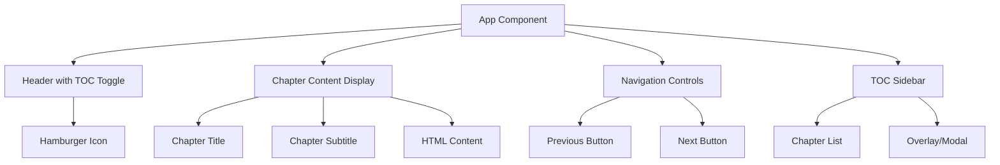
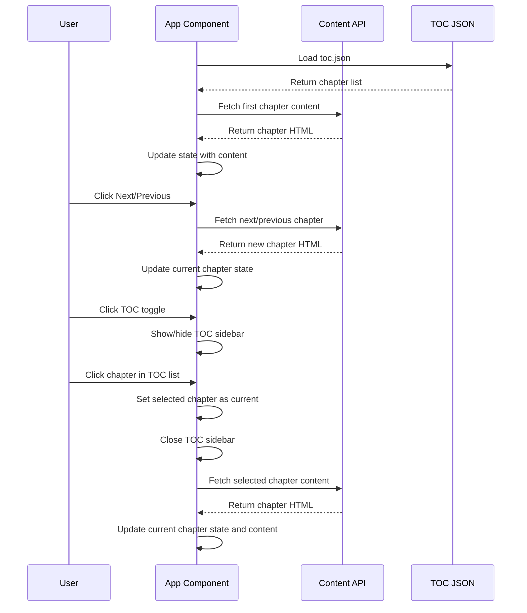
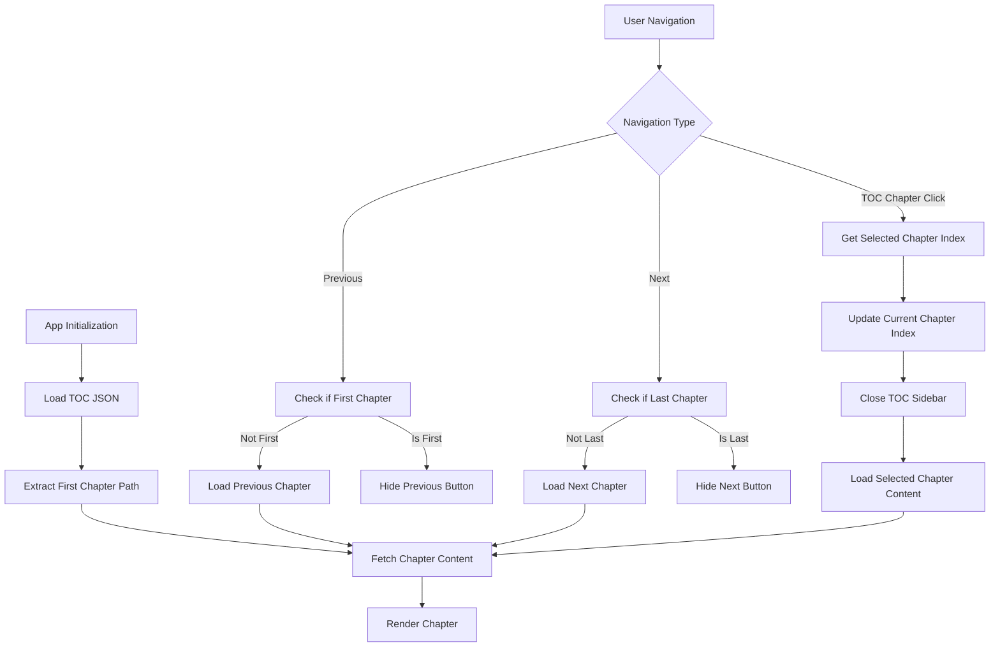

# Page Navigation Implementation Design

## Overview

This document outlines the design and implementation of a page-by-page navigation system for a novel reading website. The application will load chapter content dynamically based on a table of contents (TOC) JSON file, providing seamless reading experience with previous/next navigation and a collapsible TOC menu.

## Architecture

### Component Structure



### Data Flow



## Technology Stack & Dependencies

- **Frontend Framework**: React 19.1.1 with TypeScript
- **Build Tool**: Vite 7.1.2
- **State Management**: React useState hooks
- **Styling**: CSS with responsive design
- **Content Loading**: Fetch API for dynamic content loading
- **Icon Library**: CSS-based hamburger menu icon

## Component Architecture

### App Component State Management

```typescript
interface Chapter {
  chapterTitle: string;
  subTitle: string;
  path: string;
}

interface AppState {
  chapters: Chapter[];
  currentChapterIndex: number;
  chapterContent: string;
  showTOC: boolean;
  loading: boolean;
  error: string | null;
}
```

### Component Hierarchy

#### 1. App Component (Main Container)
- **Responsibilities**:
  - Manage application state
  - Load TOC data on mount
  - Handle chapter navigation
  - Control TOC visibility
  - Fetch and display chapter content

#### 2. Header Component
- **Elements**:
  - Hamburger menu icon (TOC toggle)
  - Application title/branding
- **Interactions**:
  - Toggle TOC sidebar visibility

#### 3. ChapterDisplay Component
- **Elements**:
  - Chapter title and subtitle
  - HTML content container
- **Features**:
  - Dynamic content rendering
  - Loading states
  - Error handling

#### 4. NavigationControls Component
- **Elements**:
  - Previous button (hidden on first chapter)
  - Next button (hidden on last chapter)
- **Features**:
  - Conditional rendering based on chapter position
  - Keyboard navigation support

#### 5. TOCSidebar Component
- **Elements**:
  - Overlay/backdrop
  - Chapter list with titles and subtitles
  - Border separators between chapters
- **Features**:
  - Modal-style overlay
  - Click-to-select chapters for navigation
  - Chapter selection loads corresponding page content
  - Close TOC after chapter selection
  - Responsive design

## Routing & Navigation

### Chapter Loading Strategy



### URL State Management
- Use React state for chapter tracking
- Optional: Browser history integration for back/forward support
- Persist current chapter in localStorage for session recovery

## Styling Strategy

### Layout Structure
```css
.app-container {
  display: flex;
  flex-direction: column;
  min-height: 100vh;
}

.header {
  position: fixed;
  top: 0;
  width: 100%;
  z-index: 100;
}

.content-area {
  flex: 1;
  margin-top: header-height;
  padding: 20px;
}

.navigation-controls {
  position: fixed;
  bottom: 20px;
  width: 100%;
  display: flex;
  justify-content: space-between;
}
```

### TOC Sidebar Styling
```css
.toc-overlay {
  position: fixed;
  top: 0;
  left: 0;
  width: 100vw;
  height: 100vh;
  background: rgba(0, 0, 0, 0.5);
  z-index: 200;
}

.toc-sidebar {
  position: fixed;
  top: 0;
  left: 0;
  width: 320px;
  height: 100vh;
  background: white;
  overflow-y: auto;
  transform: translateX(-100%);
  transition: transform 0.3s ease;
}

.toc-sidebar.open {
  transform: translateX(0);
}

.chapter-item {
  padding: 16px 20px;
  border-bottom: 1px solid #e0e0e0;
  cursor: pointer;
  transition: background-color 0.2s ease;
}

.chapter-item:hover {
  background-color: #f5f5f5;
}

.chapter-item.active {
  background-color: #e3f2fd;
  border-left: 4px solid #2196f3;
}

.chapter-title {
  font-weight: 600;
  margin-bottom: 4px;
  color: #333;
}

.chapter-subtitle {
  font-size: 14px;
  color: #666;
  line-height: 1.4;
}
```

### Responsive Design
- Mobile-first approach
- Hamburger menu for mobile navigation
- Adaptive text sizing
- Touch-friendly button sizes
- Swipe gesture support (future enhancement)

## API Integration Layer

### Content Loading Functions

```typescript
// Load table of contents
async function loadTOC(): Promise<Chapter[]> {
  const response = await fetch('/toc.json');
  return response.json();
}

// Load chapter content
async function loadChapter(path: string): Promise<string> {
  const response = await fetch(`/${path}`);
  return response.text();
}

// Navigation helpers
function getNextChapter(currentIndex: number, chapters: Chapter[]): Chapter | null {
  return currentIndex < chapters.length - 1 ? chapters[currentIndex + 1] : null;
}

function getPreviousChapter(currentIndex: number, chapters: Chapter[]): Chapter | null {
  return currentIndex > 0 ? chapters[currentIndex - 1] : null;
}

// TOC chapter selection handler
async function handleChapterSelection(
  chapterIndex: number, 
  chapters: Chapter[], 
  setCurrentChapterIndex: (index: number) => void,
  setChapterContent: (content: string) => void,
  setShowTOC: (show: boolean) => void,
  setLoading: (loading: boolean) => void
): Promise<void> {
  try {
    setLoading(true);
    setCurrentChapterIndex(chapterIndex);
    setShowTOC(false); // Close TOC sidebar
    
    const selectedChapter = chapters[chapterIndex];
    const content = await loadChapter(selectedChapter.path);
    setChapterContent(content);
  } catch (error) {
    console.error('Error loading selected chapter:', error);
  } finally {
    setLoading(false);
  }
}
```

### Error Handling
- Network error recovery
- Content loading fallbacks
- User-friendly error messages
- Retry mechanisms for failed requests

## Testing Strategy

### Unit Testing
- Component rendering tests
- State management tests
- Navigation logic tests
- Content loading tests

### Integration Testing
- Full navigation flow tests
- TOC interaction tests
- Error handling scenarios
- Responsive behavior tests

### User Experience Testing
- Reading flow validation
- Navigation accessibility
- Performance optimization
- Cross-browser compatibility

## Implementation Phases

### Phase 1: Core Navigation
1. Basic App component setup
2. TOC JSON loading
3. Chapter content display
4. Previous/Next navigation
5. Basic styling

### Phase 2: TOC Interface
1. Hamburger menu implementation
2. TOC sidebar design
3. Chapter selection functionality
4. Overlay interactions
5. Mobile responsiveness

### Phase 3: Enhancement & Polish
1. Loading states and animations
2. Error handling improvements
3. Keyboard navigation
4. Performance optimizations
5. Accessibility features

### Phase 4: Advanced Features
1. Reading progress tracking
2. Bookmarking capabilities
3. Search functionality
4. Theme customization
5. Offline reading support

## Performance Considerations

### Content Loading Optimization
- Lazy loading for chapter content
- Preloading next/previous chapters
- Content caching strategies
- Image optimization for chapter content

### Bundle Optimization
- Code splitting by routes
- Dynamic imports for large components
- Tree shaking for unused dependencies
- Minimize JavaScript bundle size

### Runtime Performance
- Virtual scrolling for long content
- Debounced navigation actions
- Memory management for loaded content
- Efficient re-rendering strategies

## Accessibility Features

### Keyboard Navigation
- Tab order optimization
- Arrow key navigation
- Enter/Space key activation
- Escape key for closing TOC

### Screen Reader Support
- Semantic HTML structure
- ARIA labels and roles
- Focus management
- Content announcements

### Visual Accessibility
- High contrast mode support
- Scalable text sizes
- Clear visual indicators
- Reduced motion options