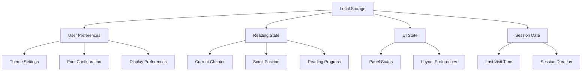
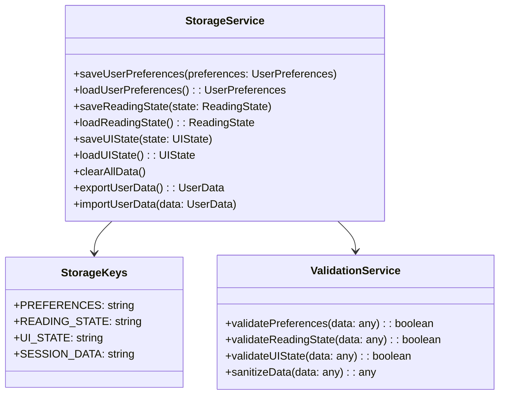
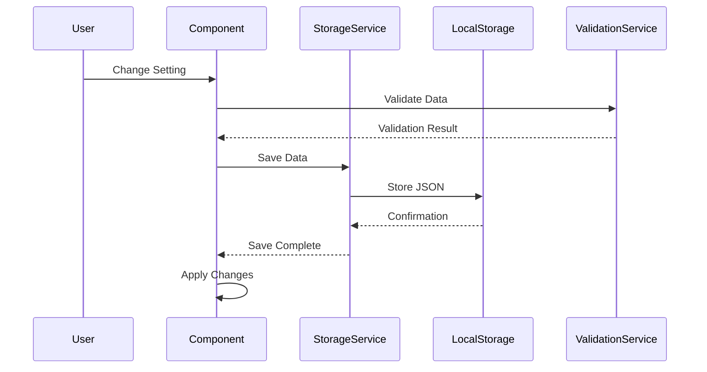
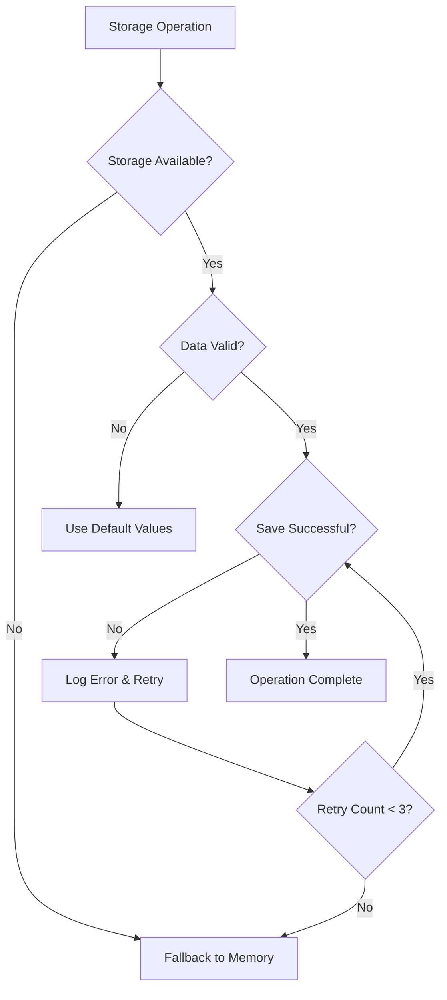

# Save User Settings to Local Storage

## Overview
This design document outlines a comprehensive local storage system for persisting user preferences and application state in the novel reading application. The system will save and restore user settings including theme, font, font size, current page/chapter, scroll position, and other UI preferences to provide a seamless reading experience across browser sessions.

## Architecture

### Data Structure Design
The local storage system will use a hierarchical JSON structure to organize different categories of persistent data:



### Storage Schema Definition

| Storage Key | Data Type | Description | Default Value |
|-------------|-----------|-------------|---------------|
| `novel-preferences` | UserPreferences | Theme, font, and display settings | `defaultPreferences` |
| `novel-reading-state` | ReadingState | Current chapter and scroll position | `defaultReadingState` |
| `novel-ui-state` | UIState | Panel visibility and layout preferences | `defaultUIState` |
| `novel-session-data` | SessionData | Session tracking and analytics | `defaultSessionData` |

## Data Models & TypeScript Interfaces

### Enhanced User Preferences Interface
```typescript
interface UserPreferences {
  theme: 'system' | 'light' | 'dark';
  font: 'system' | 'myanmarsanpya' | 'myanmartagu' | 'masterpiecestadium' | 'pyidaungsu';
  fontSize: 'small' | 'medium' | 'large';
  lineHeight: 'compact' | 'normal' | 'relaxed';
  textAlign: 'left' | 'center' | 'justify';
  pageWidth: 'narrow' | 'normal' | 'wide';
}

interface ReadingState {
  currentChapterIndex: number;
  scrollPosition: number;
  lastReadTime: string;
  readingProgress: {
    [chapterIndex: number]: {
      scrollPosition: number;
      readPercentage: number;
      lastVisited: string;
    };
  };
}

interface UIState {
  showTOC: boolean;
  showSettings: boolean;
  lastActivePanel: 'toc' | 'settings' | null;
  contentAreaWidth: number;
  navigationPreference: 'buttons' | 'keyboard' | 'swipe';
}

interface SessionData {
  sessionId: string;
  lastVisitTime: string;
  totalReadingTime: number;
  chaptersRead: number[];
  bookmarkPositions: BookmarkPosition[];
}

interface BookmarkPosition {
  chapterIndex: number;
  scrollPosition: number;
  timestamp: string;
  note?: string;
}
```

## Storage Management System

### Storage Service Architecture


### Storage Implementation Strategy

#### Automatic Save Triggers
| Event | Data to Save | Debounce Time |
|-------|-------------|---------------|
| Theme Change | User Preferences | Immediate |
| Font Change | User Preferences | Immediate |
| Chapter Navigation | Reading State | 500ms |
| Scroll Position | Reading State | 1000ms |
| Panel Toggle | UI State | Immediate |
| Settings Update | User Preferences | Immediate |

#### Data Persistence Workflow


## Reading State Management

### Scroll Position Tracking
The system will implement intelligent scroll position tracking with the following features:

- **Debounced Save**: Scroll position saved every 1 second during active scrolling
- **Chapter-Specific Positions**: Each chapter maintains its own scroll position
- **Reading Progress Calculation**: Percentage-based progress tracking per chapter
- **Cross-Session Restoration**: Automatic scroll position restoration on chapter load

### Chapter State Persistence
```typescript
interface ChapterState {
  index: number;
  scrollPosition: number;
  readPercentage: number;
  timeSpent: number;
  lastVisited: string;
  isCompleted: boolean;
}
```

## UI State Synchronization

### Panel State Management
The application will persist UI panel states including:

- Table of Contents visibility
- Settings panel visibility  
- Last active panel preference
- Panel animation states

### Layout Preferences
User layout customizations will be preserved:

- Content area width adjustments
- Navigation control preferences
- Reading view mode (full-screen, windowed)

## Error Handling & Data Validation

### Storage Error Recovery


### Data Validation Rules
- **Type Checking**: Validate all data types before storage operations
- **Schema Validation**: Ensure data structure matches expected interfaces
- **Sanitization**: Clean and validate user input data
- **Version Compatibility**: Handle data migration for schema changes

## Performance Considerations

### Optimization Strategies
- **Debounced Writes**: Prevent excessive localStorage writes during rapid changes
- **Selective Updates**: Only save changed data sections, not entire state
- **Compression**: Use JSON compression for large datasets
- **Cache Management**: Maintain in-memory cache for frequently accessed data

### Storage Quotas
- **Quota Monitoring**: Track localStorage usage and warn users at 80% capacity
- **Data Cleanup**: Implement automatic cleanup of old session data
- **Fallback Strategy**: Graceful degradation when storage quota exceeded

## Testing Strategy

### Unit Testing Requirements
| Component | Test Coverage | Key Test Cases |
|-----------|---------------|----------------|
| StorageService | 95% | Save/Load operations, error handling |
| ValidationService | 100% | Data validation, sanitization |
| State Management | 90% | State synchronization, persistence |
| Error Recovery | 85% | Fallback mechanisms, quota handling |

### Integration Testing
- **Cross-Browser Compatibility**: Test localStorage behavior across browsers
- **Storage Persistence**: Verify data persistence across browser sessions
- **Performance Testing**: Measure save/load operation performance
- **Error Simulation**: Test behavior under storage failure conditions

## Implementation Phases

### Phase 1: Core Storage Infrastructure
- Implement basic StorageService class
- Add data validation and error handling
- Create TypeScript interfaces for all data models
- Implement save/load operations for user preferences

### Phase 2: Reading State Persistence  
- Add scroll position tracking with debouncing
- Implement chapter-specific state management
- Create reading progress calculation system
- Add automatic state restoration on app load

### Phase 3: Advanced Features
- Implement bookmark system
- Add data export/import functionality
- Create storage analytics and monitoring
- Implement data migration system for schema changes

### Phase 4: Performance & Polish
- Add storage quota management
- Implement data compression
- Add advanced error recovery
- Optimize performance for large datasets